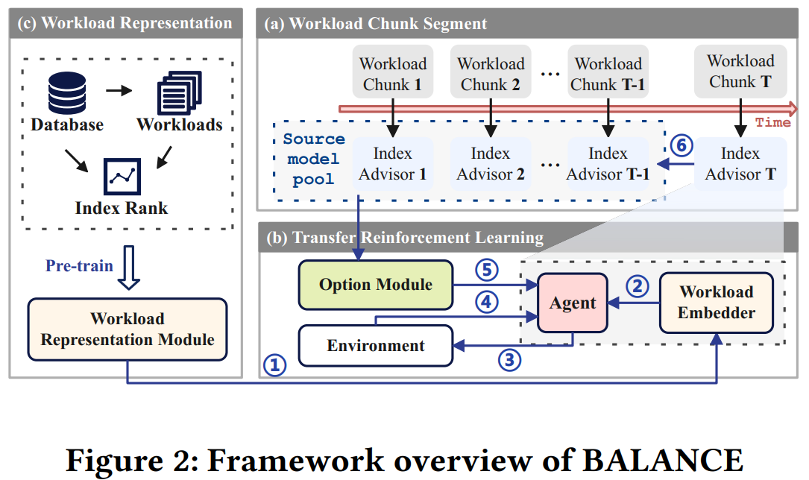

# BALANCE
Boosting Index Advisor Learning with Multi-Source Workload Knowledge

Above is the overall architecture of BALANCE, and the code runs on Postgresql 12.5.
### Code structure
```
│  box_line.pickle      # Predicate value box
│  main.py              # Main process file
│  README.md            # Code documentation
│  requirements.txt     # Experimental
│
├─balance
│      action_manager.py     
│      boo.py
│      configuration_parser.py
│      embedding_utils.py
│      experiment.py
│      observation_manager.py
│      reward_calculator.py
│      schema.py
│      utils.py
│      workload_embedder.py
│      workload_generator.py
│
├─experiments
│      tpcds.json         # setting files on TPCDS     
│      tpch.json          # setting files on TPCH
│
├─experiment_results
│  ├─cl_save              # cl model 
│  │  └─gen_model
│  │          boo_bao_nosame_f_v.pth  
│  │
│  ├─source               # transfer sources 
│  │      f_s1.zip
│  │      f_s2.zip
│  │      f_s3.zip
│  │
│  └─workloads            # workloads on TPCH 
│      └─gen_tpch
│              train_workloads1.pickle            
│              train_workloads1_value.pickle      
│
├─gym_db
│  │  common.py
│  │
│  └─envs
│         db_env_v1.py        # Reinforcement learning environment
│  
│
├─index_selection_evaluation  # database utils
├─query_files
│  ├─TPCDS
│  └─TPCH
├─src                         # value embedder
│  │  parameters.py
│  ├─ feature_extraction
│  ├─ plan_encoding
│  └─ token_embedding
│
└─stable_baselines            # Reinforcement learning Toolkit
   └─ ppo2            
           ppo2_PTF_w.py
```
### Example workflow

```
pip install -r requirements.txt         # Install requirements with pip
python main.py                          # Run a experiment
```
Experiments can be controlled with the **./experiments/tpch.json** file. For descriptions of the components and functioning, consult our paper.
